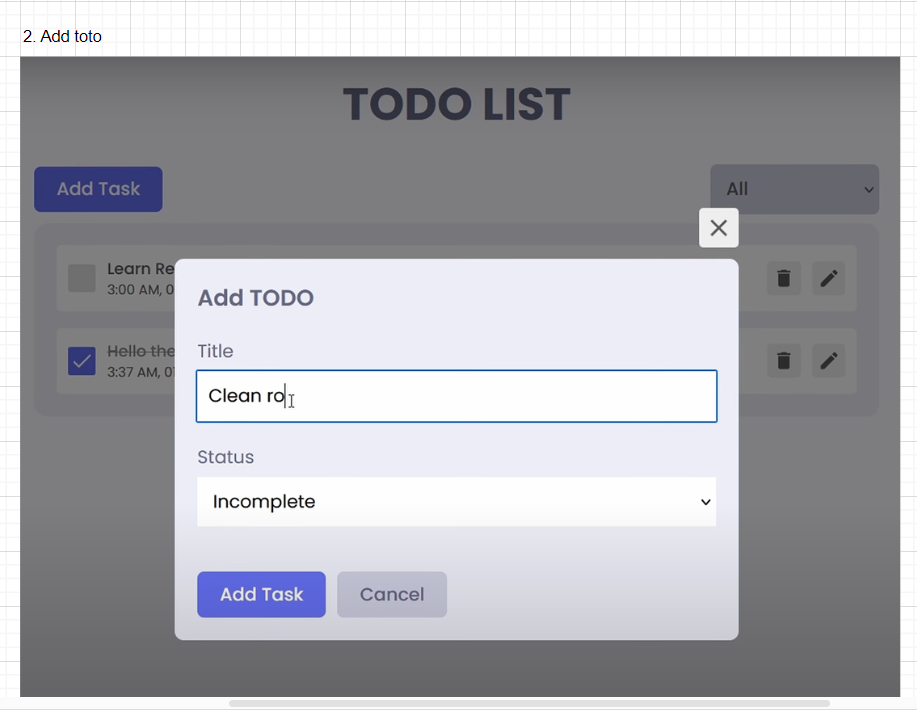
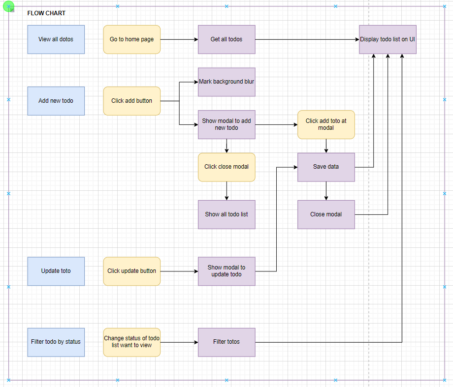
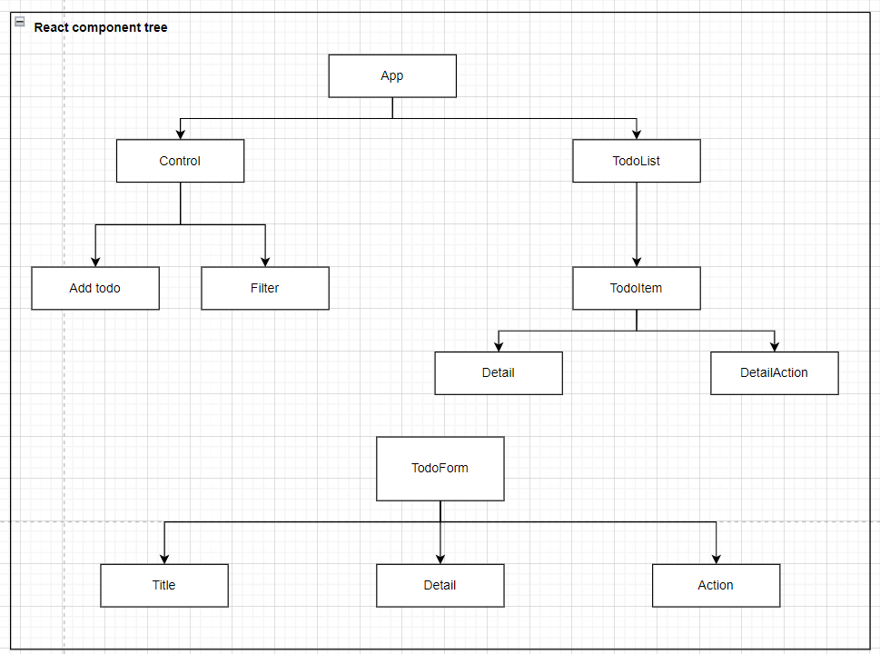

# React todo app

## Overview

Welcome to react-dodo-app! This project is a sleek and feature-rich Todo app built with React and powered by Redux for state management. It leverages the robust Django Rest Framework (DRF) for a scalable backend and utilizes a database for seamless data management.

## Features

- View all todos (DONE)
- Add new todo (DONE)
- Filter todo by status (DONE)
- Delete todo (DONE)
- Update todo (DONE)
- Local storage (DONE)

## Architecture

- Github ref: https://github.com/ShaifArfan/react-todo-app
- Draw.io: https://drive.google.com/file/d/1tRO5aESt5teVJhgO-NWEAShtsVOlmZ5z/view?usp=sharing

### Mockup UI





### User stories


### Flow chart



### Components



## Getting Started

### Prerequisites

- React
- npm
- Javascript

### Installation

1. Clone the repository:

   ```bash
   git clone https://github.com/truongtran990/react-todos-app.git
   ```

## References

- Modal: https://dev.to/franciscomendes10866/how-to-create-a-modal-in-react-3coc
- localStorage: https://blog.logrocket.com/localstorage-javascript-complete-guide/#:~:text=localStorage%20is%20a%20property%20that,browser%20or%20restarts%20the%20computer.
