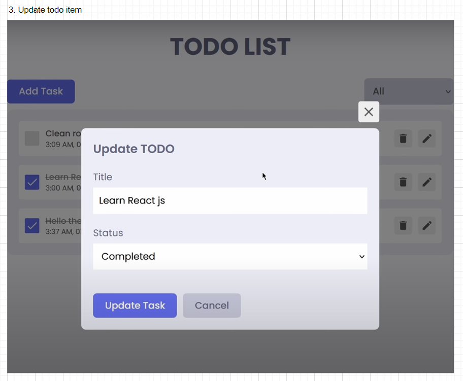
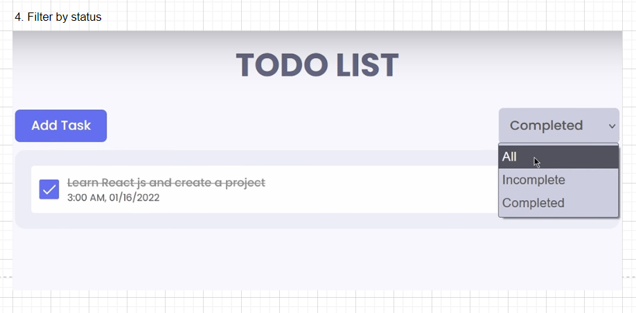
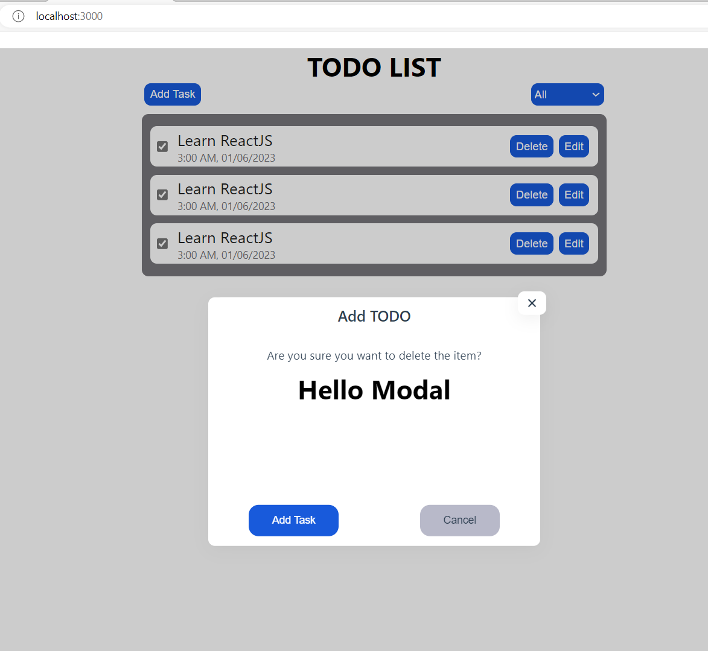
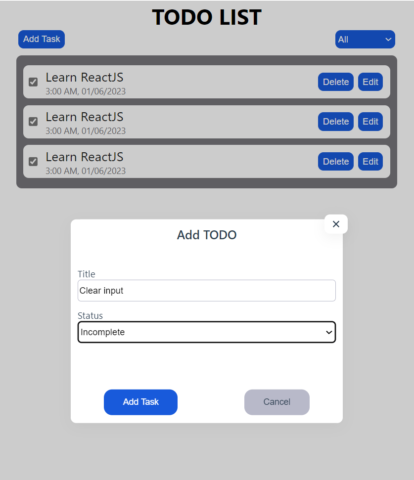

# 1. Architecture

Github ref: https://github.com/ShaifArfan/react-todo-app
Draw.io: https://drive.google.com/file/d/1tRO5aESt5teVJhgO-NWEAShtsVOlmZ5z/view?usp=sharing

## 1.1. Mockup UI

## 1.2. User stories

## 1.3. Flow chart

## 1.4. Components

#### Track history

- View all todos (DONE)
- Filter todo by status (DONE)

# 3. References

- https://dev.to/franciscomendes10866/how-to-create-a-modal-in-react-3coc
