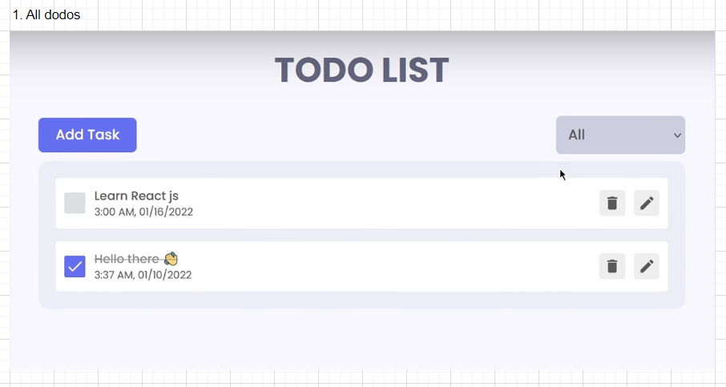
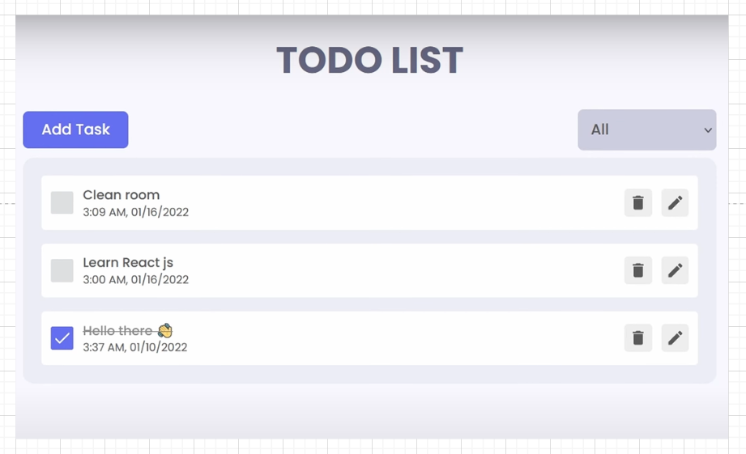
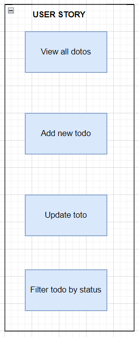

# 1. Features

- View all todos (DONE)
- Add new todo (DONE)
- Filter todo by status (DONE)
- Delete todo (DONE)
- Update todo (DONE)
- Local storage (DONE)

# 2. Architecture

- Github ref: https://github.com/ShaifArfan/react-todo-app
- Draw.io: https://drive.google.com/file/d/1tRO5aESt5teVJhgO-NWEAShtsVOlmZ5z/view?usp=sharing

## 1.1. Mockup UI

## 1.2. User stories

## 1.3. Flow chart

## 1.4. Components

# 2. References

- Modal: https://dev.to/franciscomendes10866/how-to-create-a-modal-in-react-3coc
- localStorage: https://blog.logrocket.com/localstorage-javascript-complete-guide/#:~:text=localStorage%20is%20a%20property%20that,browser%20or%20restarts%20the%20computer.
